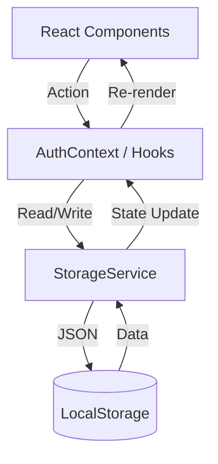

# Architecture & Data Flow

## Technology Stack

- **Frontend Framework**: React 18 (Vite)
- **State Management**: React Context API (`AuthContext`)
- **Styling**: Tailwind CSS v4
- **Routing**: React Router v6
- **Persistence**: LocalStorage (via `StorageService`)
- **PWA**: `vite-plugin-pwa`

## Data Flow

The application follows a unidirectional data flow, but instead of making API calls to a backend server, it interacts with a local `StorageService`.

### Components

- **Pages**: Top-level views (`Dashboard`, `AddExpense`, `Analytics`).
- **Components**: Reusable UI blocks (`Navbar`, `LoadingScreen`, `PrivateRoute`).
- **Services**: Business logic and data access (`StorageService.js`).

### Authentication Flow (Offline)

1.  **Register**: Accepts user input -> Saves user object to `localStorage` key `expense_tracker_users`.
2.  **Login**: Accepts email -> Checks `localStorage` -> If match, sets active session token.
3.  **Session**: On app load, `AuthContext` checks for session token. If found, user is logged in.

## Directory Structure

- `client/src/context`: Manages global state (User, Theme).
- `client/src/services`: Abstraction layer for `localStorage`.
- `client/src/pages`: Main application screens.
